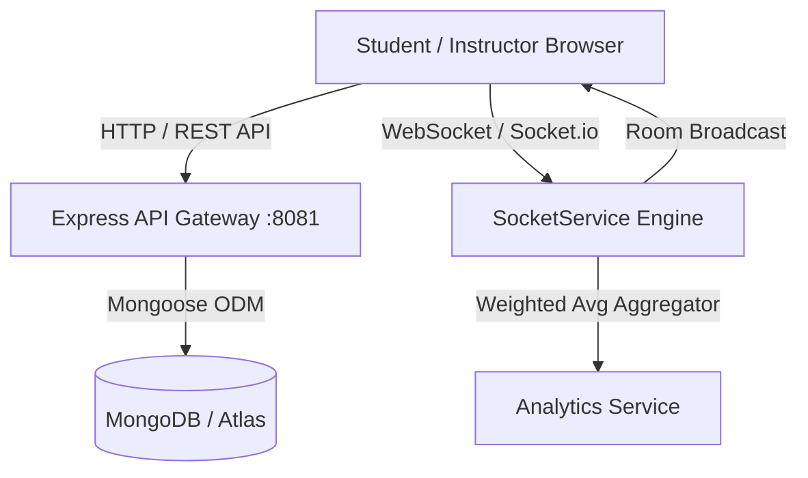

# SyncPoll — Real-Time Classroom Participation Engine

**SyncPoll** is a production-grade, real-time classroom engagement platform designed for modern lectures. It connects students and instructors via Socket.io WebSockets, providing live confusion pulse monitoring, interactive polling, and an anonymous Q&A queue.

---

## 🏗 System Architecture



---

## ✨ Core Features

- **Zen SaaS Enterprise UI**: Calm, professional `bg-slate-950` aesthetic with `#0D9488` teal accents and zero distracting neon glows.
- **Weighted Speedometer Gauge**: Aggregates 5 understanding levels into a weighted score ($\frac{\sum i \times N_i}{\sum N_i}$) updated in real time.
- **Interactive Live Polling**: Instant Recharts bar graph updates over WebSockets with zero race conditions.
- **Anonymous Q&A Queue**: Peer upvoting feed with teacher "Mark as Answered" filters.
- **Room Isolation**: Powered by `socket.join(sessionCode)` ensuring isolation per classroom.
- **Instant Action Feedback**: Integrated `react-hot-toast` notifications.

---

## 🛠 Tech Stack

- **Backend**: Node.js, Express.js, Socket.io, MongoDB / Mongoose, JWT (`jsonwebtoken`), `bcryptjs`.
- **Frontend**: React 18, React Router v6, Tailwind CSS, Recharts, Lucide Icons, `react-hot-toast`.

---

## 🚀 Local Development Quick Start

### 1. Backend Engine (Port `8081`)
```bash
cd backend
npm install
npm start
```
*Environment Configuration: Copy `.env.example` to `.env`*

### 2. Frontend Application (Port `3001`)
```bash
cd frontend
npm install
npm start
```
*Environment Configuration: Copy `.env.example` to `.env`*

---

## ☁️ Production Deployment Guide

### Deploy Backend (Render / Railway)
1. Create a new **Web Service** pointing to the `/backend` directory.
2. Build Command: `npm install`
3. Start Command: `npm start`
4. Environment Variables:
   - `PORT`: `8081`
   - `MONGODB_URI`: `<Your MongoDB Atlas Connection String>`
   - `JWT_SECRET`: `<Your Production Secret>`
   - `CORS_ORIGIN`: `https://your-frontend-domain.vercel.app`

### Deploy Frontend (Vercel / Netlify)
1. Import repository pointing to the `/frontend` directory.
2. Build Command: `npm run build`
3. Output Directory: `build`
4. Environment Variables:
   - `REACT_APP_API_URL`: `https://your-backend-service.onrender.com`
   - `REACT_APP_SOCKET_URL`: `https://your-backend-service.onrender.com`

---

## 🔌 API & Socket Reference

### REST Endpoints
- `POST /api/auth/register`: Create student/instructor account.
- `POST /api/auth/login`: Authenticate and receive JWT token.
- `GET /api/auth/me`: Fetch authenticated user profile.
- `POST /api/sessions/create`: Generate new classroom room code.
- `GET /api/sessions/:code`: Validate session code.
- `POST /api/sessions/:code/end`: End lecture session.
- `GET /api/sessions/:code/summary`: Post-lecture analytics summary report.

### Socket Events
- `join-session` $\rightarrow$ `room-state`: Joins room and returns current room state.
- `send-confusion` / `submit-pulse` $\rightarrow$ `confusion-update`: Broadcasts updated confusion score.
- `start-poll` / `create-poll` $\rightarrow$ `poll-created`: Triggers live poll modal.
- `submit-vote` / `submit-poll-vote` $\rightarrow$ `poll-update`: Updates Recharts bar graph.
- `submit-question` $\rightarrow$ `qa-update`: Appends question to anonymous Q&A queue.
- `leave-session` $\rightarrow$ `room-participants-update`: Decrements active student counter down to 0.